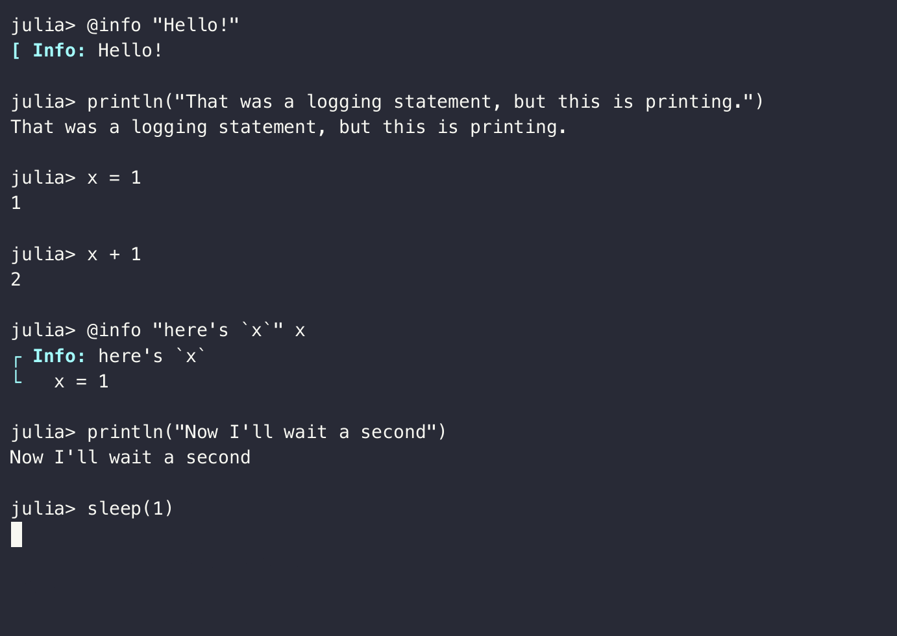

# Asciicast

[](https://ericphanson.github.io/Asciicast.jl/dev)

Asciicast.jl is a Julia package for recording Julia sessions into the `asciicast` v2 file format, <https://github.com/asciinema/asciinema/blob/asciicast-v2/doc/asciicast-v2.md>.

## Creating `.cast` files

Asciicast provides a type `Cast` which can be used for constructing asciicast v2 files, for example, using the most low-level interface:

```julia
using Asciicast
cast = Cast()
write_event!(cast, OutputEvent, "hello\n")
write_event!(cast, OutputEvent, "Let us wait...")
sleep(.5)
write_event!(cast, OutputEvent, "\nDone!")
Asciicast.save("example.cast", cast)
```
This produces the file [example.cast](./example.cast), which can be viewed as a gif (more on that later):


We can use `record_output` as a higher-level interface which will capture all of the output from a block of code and save it as a cast:

```julia
using Asciicast
record_output("example2.cast") do
    @info "Hello!"
    println("That was a logging statement, but this is printing.")
    x = 1
    x + 1 # does not print anything-- no output!
    @info "here's `x`" x
    println("Now I'll wait a second")
    sleep(1)
    println("ok, done!")
end
```


This only lets us capture the output of the function calls. To actually create a REPL-like result, we need to capture the input as well. That requires a macro:

```julia
using Asciicast

cast = cast"""
    @info "Hello!"
    println("That was a logging statement, but this is printing.")
    x = 1
    x + 1
    @info "here's `x`" x
    println("Now I'll wait a second")
    sleep(1)
    println("ok, done!")
    """

Asciicast.save("example3.cast", cast)
```




## Using `.cast` files

These `.cast` files can be used a couple different ways.

They can rendered into ".gif"s via [agg](https://github.com/asciinema/agg), which is what is used in the previous section to show the output. Here, I've used [larger font size to reduce blurriness](https://github.com/asciinema/agg/issues/60#issuecomment-1807910643), e.g. `agg --font-size 28 example3.cast example3.gif` for the third example.

This is useful for READMEs in GitHub since fancier web technologies like Javascript are not supported there. In a richer environment, an
[asciinema-player](https://github.com/asciinema/asciinema-player) can be embedded to play the cast. `Cast` objects support a `MIME"text/html"` `show` method, which means in environments that support HTML, they automatically create such a player. However, they still need the JS and CSS assets to be loaded.

Speaking of a richer environment, Asciicast.jl also provides an `@cast` block for Documenter.jl. This can be used like
an [`@repl` block](https://juliadocs.github.io/Documenter.jl/stable/man/syntax/#@repl-block), except instead of printing the output after each line, it collects the output and generates
an asciicast file. Then it produces an inline
asciinema-player to play the resulting cast.

This feature requires the necessary JS and CSS files are added to `assets` in `makedocs`. See [docs/make.jl](docs/make.jl) for an example.
