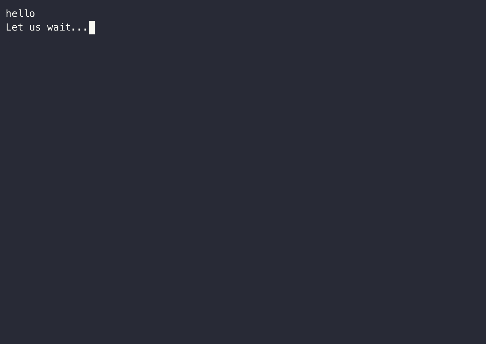
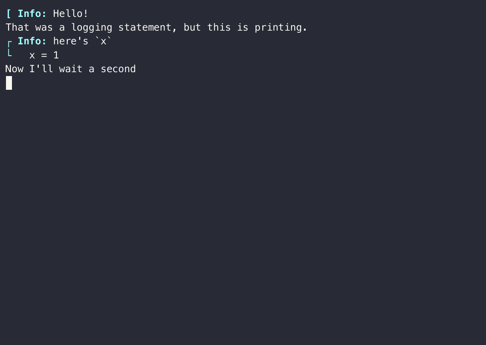

# Asciicast

[](https://ericphanson.github.io/Asciicast.jl/dev)

Asciicast.jl is a Julia package for recording Julia sessions into the `asciicast` v2 file format, <https://github.com/asciinema/asciinema/blob/asciicast-v2/doc/asciicast-v2.md>.

## Creating `.cast` files

Asciicast provides a type `Cast` which can be used for constructing asciicast v2 files, for example, using the most low-level interface:
```julia
using Asciicast
cast = Cast("example.cast")
write_event!(cast, OutputEvent, "hello\n")
write_event!(cast, OutputEvent, "Let us wait...")
sleep(.5)
write_event!(cast, OutputEvent, "\nDone!")
```
This produces the file [example.cast](./example.cast), which can be viewed as a gif (more on that later):



We can use `record_output` as a higher-level interface which will capture all of the output from a block of code and save it as a cast:

```julia
using Asciicast

record_output("example2.cast") do
    @info "Hello!"
    println("That was a logging statement, but this is printing.")
    x = 1
    x + 1 # does not print anything-- no output!
    @info "here's `x`" x
    println("Now I'll wait a second")
    sleep(1)
    println("ok, done!")
end
```




## Using `.cast` files

These `.cast` files can be used a couple different ways.

They can rendered into ".gif"s via [asciicast2gif](https://github.com/asciinema/asciicast2gif), which is what is used in the previous section to show the output.

This is useful for READMEs in GitHub since fancier web technologies like Javascript are not supported there. In a richer environment, an
[asciinema-player](https://github.com/asciinema/asciinema-player) can be embedded to play the cast.

Speaking of a richer environment, Asciicast.jl also provides an `@gif` block for Documenter.jl. This can be used like
an [`@repl` block](https://juliadocs.github.io/Documenter.jl/stable/man/syntax/#@repl-block), except instead of printing the output after each line, it collects the output and generates
an asciicast file. Then it produces an inline
asciinema-player to play the resulting cast.

This feature requires the necessary JS and CSS files are added to `assets` in `makedocs`. See [docs/make.jl](docs/make.jl) for an example.

## Note

This package is unregistered and experimental, and there are currently no tests.
